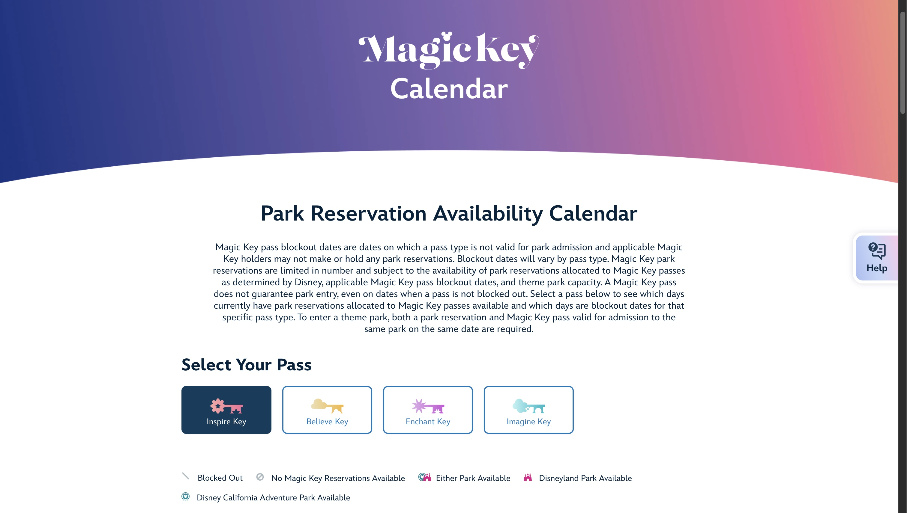

# Disneyland Magic Key Reservation Checker V2 (in development)

As a disney fan and current magic key holder I know how bothersome it can be to get reservations to the parks in California on the exact day you want, especially as they sell out. Having to refresh the reservation calendar is not plausible so I decided to make a coding portfolio project that uses web scraping to check for me and notify me when I can go in and book a particular date. This code is just a prototype to test and check how the general web scraping logic will work, will be adding to a larger application with a full front end and back end with user authentication. This app will not be published and is more of just a personal project/concept. 

## Features:
- **Selectable Dates**: Select pass type and day to watch for.
- **User authentication**: Secure login system to manage user's reservations (Max 4 per user). (to be added later in V2)

## Tech:
- **Typscript**: NextJS
- **Python**: FastAPI, SQLAlechemy, Pydantic
- **Selenium**: For web scraping and navigation of shadow DOM.

